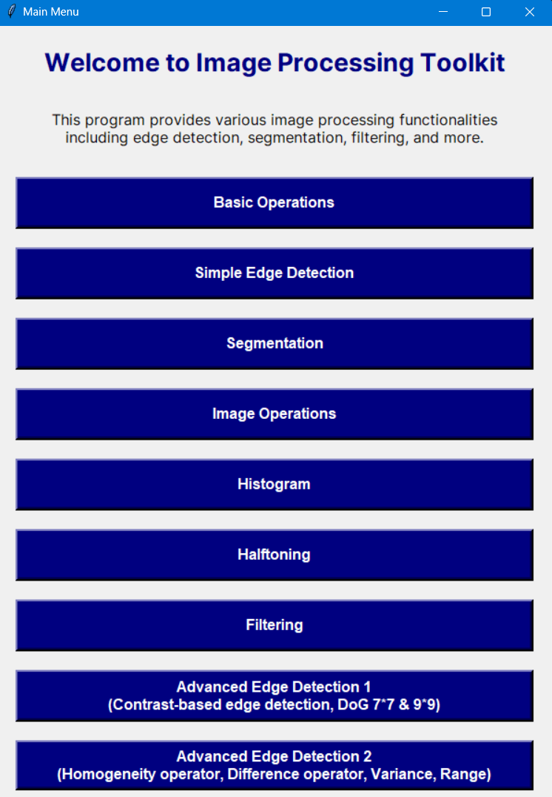

# Image Processing Toolkit

Welcome to the **Image Processing Toolkit**, a modular GUI-based application that provides a suite of image processing operations. The application is designed to help users explore various image processing techniques, including edge detection, filtering, segmentation, and more.



---

## Features

### Basic Operations

- Convert images to grayscale.
- Calculate the optimal threshold value for an image.

### Edge Detection

- Simple edge detection using basic operators.
- Advanced edge detection techniques including:
  - Difference of Gaussians (DoG).
  - Contrast-based edge detection.
  - Homogeneity, variance, and range operators.

### Filtering

- Apply high-pass filters for edge enhancement.
- Apply low-pass filters for noise reduction.
- Median filtering.

### Segmentation

- Manual threshold-based segmentation.
- Histogram peak and valley segmentation.
- Adaptive histogram-based segmentation.

### Other Features

- Halftoning techniques.
- Histogram equalization and analysis.
- Image operations like inversion, addition, and subtraction.

---

## Folder Structure

    Image-Processing-Toolkit/
    ├── AdvancedEdgeDetection/
    │   ├── EdgeDetectionGUI.py          # Advanced edge detection (DoG, contrast-based)
    │   ├── EdgeDetection2GUI.py         # Additional edge detection methods (homogeneity operator, difference operator, variance, range)
    ├── BasicGUI.py                      # Basic operations (grayscale, thresholding)
    ├── Filtering/
    │   └── FilterGUI.py                 # Filtering operations (low-pass, high-pass, median filters)
    ├── Halftoning/
    │   └── HalftoningGUI.py             # Halftoning techniques
    ├── Histogram/
    │   └── HistogramGUI.py              # Histogram equalization and analysis
    ├── Img/                             # Sample images for testing the operations
    │   ├── image1.jpg
    │   ├── image2.png
    │   └── ...                          # Add more test images as needed
    ├── ImageOperations/
    │   └── ImageOperationsGUI.py        # Image operations (addition, subtraction, inversion)
    ├── Segmentation/
    │   └── SegmentationGUI.py           # Segmentation techniques (manual, adaptive, etc.)
    ├── SimpleEdgeDetection/
    │   └── EdgeDetectionGUI.py          # Simple edge detection techniques
    ├── Main.py                          # Main menu GUI for navigation
    └── README.md                        # Project documentation

## Getting Started

### Prerequisites

Make sure you have the following installed on your system:

- Python 3.8+
- Pillow (`pip install pillow`)
- NumPy (`pip install numpy`)
- Matplotlib (`pip install matplotlib`)
- OpenCV (`pip install opencv-python`)

### Installation

1. Clone this repository:
   ```bash
   git clone https://github.com/your-username/Image-Processing-Toolkit.git
   ```
2. Navigate to the project directory:
   ```bash
    cd Image-Processing-Toolkit
   ```
3. Run the main menu to start the application:
   ```bash
   python Main.py
   ```

### How to Use

1. Launch the application by running Main.py.
2. Use the menu to navigate to different functionalities:
   - Basic operations like grayscale conversion and threshold calculation.
   - Advanced edge detection methods.
   - Image filtering, segmentation, and more.
3. Upload your images and experiment with the available tools.

## Contributing

Contributions are welcome! If you'd like to contribute to this project, please follow these steps:

1. Fork the repository.
2. Create a new branch for your feature:
   ```bash
   git checkout -b feature-name
   ```
3. Commit your changes:
   ```bash
   git commit -m "Add feature-name"
   ```
4. Push to the branch:
   ```bash
   git push origin feature-name
   ```
5. Submit a pull request to the main repository.

## License

This project is licensed under the MIT License.
